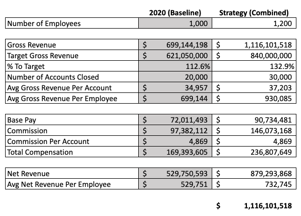

# Human Resource Forecasting Model

In this capstone project, I combine concepts of HR strategy and financial forecasting. The purpose of this HR Forecasting Model is twofold: to determine whether the company should change its compensation structure and to determine the number of people to hire to achieve the revenue target. To provide more context, I then put together an interactive dashboard designed to help the HR team easily visualize the new compensation model in effect.  

To set a specific benchmark for my baseline model, I assume that the board has set a goal to make a gross revenue of $1 billion in the following year, and the human resources (HR) department must optimize hiring planning as well as the compensation structure. The original .xlsx file of the data set used can be found here.

**Goal** 

My key responsibility was to create a forecasting tool and to ensure that a company's compensation strategy and headcount planning are in line with the gross revenue target. 

**Method**

First, I analyzed the existing data to compile two sets of commission calculations: the original calculations derived from the baseline assumptions and the new calculations derived from the forecasted assumptions. I modeled out three scenarios to solve for revenue optimization.
The three scenarios I defined are:
Assume consistent compensation structure and no growth in headcount. Optimize by assuming that the company grows its book of business.
Modify the pay structure to boost incentives for employees and maximize revenue.
Increase the headcount.

**Result**

I found that there are pros and cons to each strategy and that it is unlikely that I reach the revenue goal of $1 billion by relying on one strategy. I decided to optimize all three by blending them together: modifying quotas, growth, headcount, and commission structure.
The figure below compares the forecasted model to the baseline model. I increase the headcount by 200, increase both the commission and base pay, and assume there is robust growth in the number of accounts closed. 

**Final Note**

To finish off my analysis, I put together an interactive Excel dashboard to analyze performance at the job-title level. Rather than modeling high-level strategies for increasing company gross revenue, I wanted to build a dashboard to help the HR team easily visualize the new compensation model in effect and to understand the combined performance of all employees. The resulting dashboard drill into the data by job category at the employee level to identify employee performances that lie above or below a certain level.

